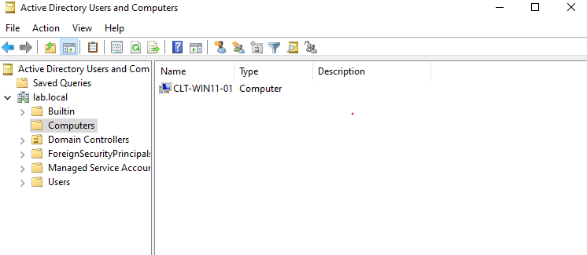
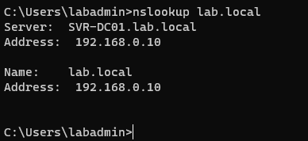
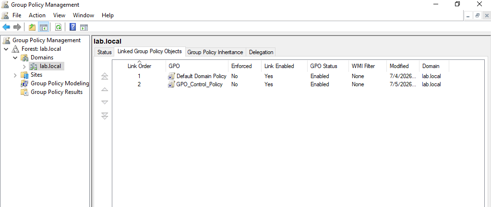
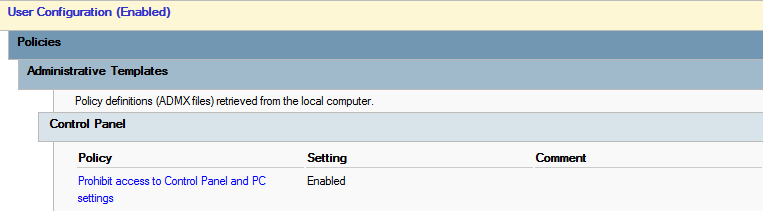
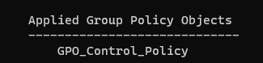
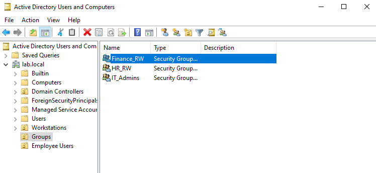
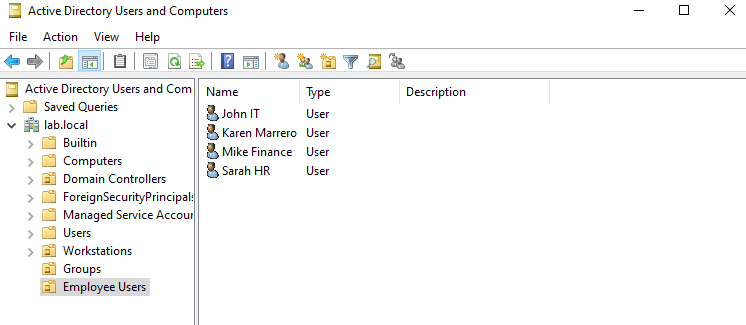
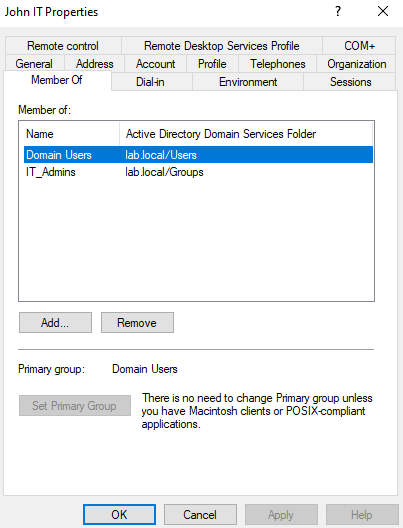

# sysadmin-home-lab
Multi-lab IT home environment built using Windows Server and Windows 11 in VirtualBox. Includes system administration labs such as Windows Server setup, Active Directory, user management, networking, and infrastructure configuration.
## Lab 1

Windows Server successfully booted.

Windows virtual machine was installed and configured using a local account. System information was verifies in the About section.
### Troubleshooting
- VM froze at login > fixed by restarting VirtualBox and adjusting display settings
- ISO didn't boot > resolved by removing and re-attaching the virtual optical drive
### What I learned 
- Virtual machines rely on host hardware resources (CPU, RAM, disk)
- Proper resource allocation is important for system stability and performance 
- Basic understanding of virtualization concepts in IT environments 
## Lab 2 - Active Directory Domain Services

Installed Active Directory Domain Services (AD DS) and promoted the Windows Server to a Domain Controller for lab.local
### What I learned
- How Active Directory centralizes user and computer management 
- Difference between local machine and domain environment
### Troubleshooting
- Resolved installation steps using default settings in Server Manager 
## Lab 3

The client machine was successfully joined to the lab.local domain and automatically registered in Active Directory under Computers container

DNS resolution was verified from the client machine confirming proper communication with the Domain Controller
### Troubleshooting
Client could not communicate with Domain Controller due to incorrect network setting (NAT) > Changed network to Internal Network. Static IP addressing was configured for both the server and client. After running ipconfig verification and flushing DNS, domain join functionality worked successfully
### Extra Configurations
Created Reverse Lookup Zone for IP-to-hostname resolution
### What I learned
Proper name resolution requires both forward (A records) and reverse (PTR records) zones
Incorrect network settings can break domain communication
Troubleshooting usually starts with checking IP and DNS settings and tools like nslookup and flushing DNS help verify and refresh name resolution
## Lab 4
### Steps Performed
Created a Group Policy Object in Active Directory
Created and used a dedicated Organizational Unite (Workstations)
Linked GPO to Workstations OU
Configured policy to restrict Control Panel access
Applied policy using gpupdate /force
Verified policy using gpresult /r

### Troubleshooting 
Group Policy did bnot initially apply to client > Forced policy update using gpupdate /force and verified successful application using gpresult /r
### What I learned 
Group Policy allows centralized management of users and compiters in an Actyive Directory domain
## Lab 5 
## Steps Performed 
Created Employee Users OU to store domain user accounts
Created Groups OU to store security groups
Confirmed Workstations OU for client machines 
Created Domain Users, Security Groups, and assigned Users to Groups (RBAC)
Verified Group membership 

### What I learned 
Role-Based Access Control (RBAC) is based on group membership, not individual users
Active Directory uses groups to simplify permission management 
Users inherit access rights through secuirty groups
Proper OU structure improves organization and scalability in AD environments 
