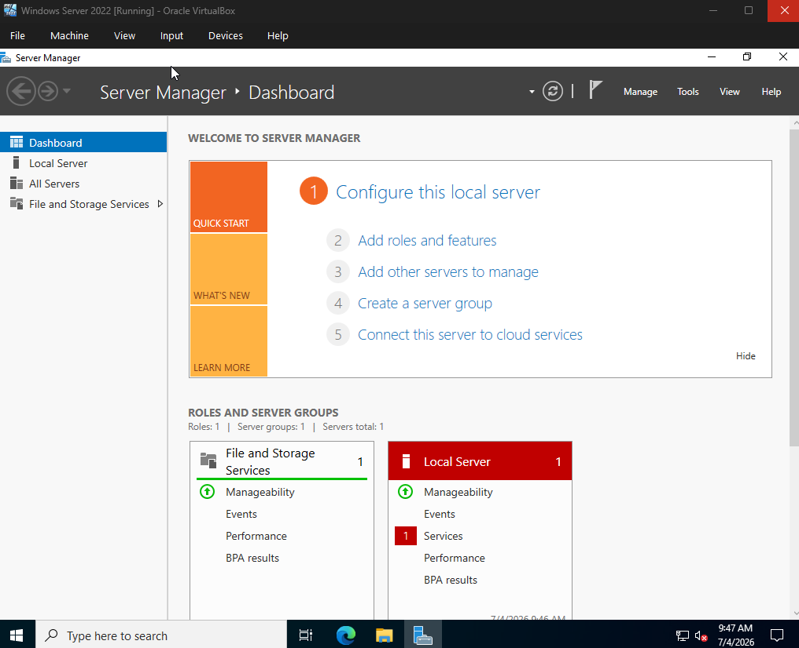
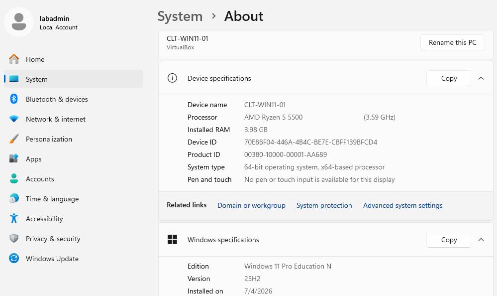
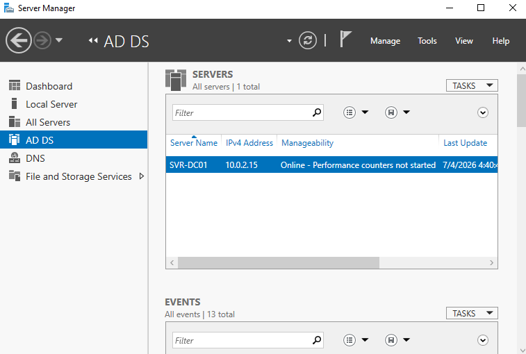
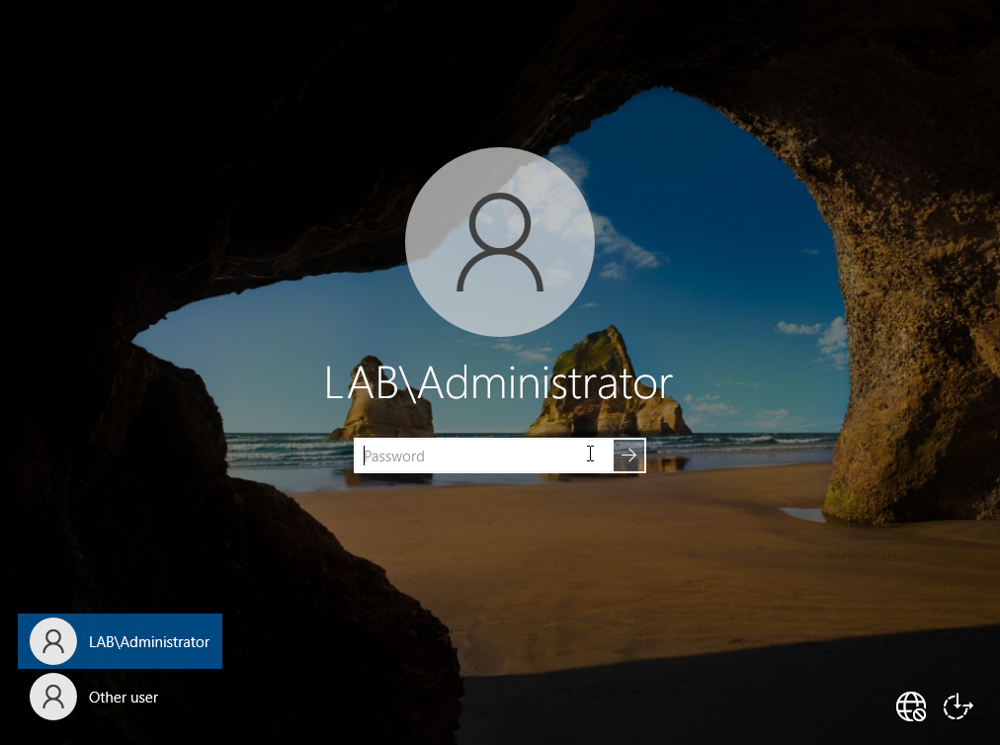

# sysadmin-home-lab
Multi-lab IT home environment built using Windows Server and Windows 11 in VirtualBox. Includes system administration labs such as Windows Server setup, Active Directory, user management, networking, and infrastructure configuration.
## Lab 1

Windows Server successfully booted.

Windows virtual machine was installed and configured using a local account. System information was verifies in the About section.
### Troubleshooting
- VM froze at login > fixed by restarting VirtualBox and adjusting display settings
- ISO didn't boot > resolved by removing and re-attaching the virtual optical drive
### What I learned 
- Virtual machines rely on host hardware resources (CPU, RAM, disk)
- Proper resource allocation is important for system stability and performance 
- Basic understanding of virtualization concepts in IT environments 
## Lab 2 - Active Directory Domain Services

This shows the AD DS successfully installed on the Windows Server

This shows the server being promoted to a Domain Controller and the creation of the lab.local domain
### What I learned
- How Active Directory centralizes user and computer management 
- Difference between local machine and domain environment
### Troubleshooting
- Resolved installation steps using default settings in Server Manager 
